# 🚗 CarStore & Service Management System

A Windows desktop application for running a car showroom and its service workshop. Customers buy cars and book services, employees process that work, and an administrator manages accounts, prices and reports.

**C#** · **.NET Framework 4.8** · **Windows Forms** · **SQL Server** · **ADO.NET**

---

## 📑 Contents

- [Demo video](#-demo-video)
- [Features](#-features)
- [Screenshots](#-screenshots)
- [Technology stack](#-technology-stack)
- [Architecture](#-architecture)
- [Use case diagrams](#-use-case-diagrams)
- [Workflows](#-workflows)
- [Database design](#-database-design)
- [OOP concepts](#-oop-concepts)
- [Security](#-security)
- [Getting started](#-getting-started)
- [Demo accounts](#-demo-accounts)
- [Project structure](#-project-structure)
- [Testing](#-testing)
- [Known limitations](#-known-limitations)
- [Academic context](#-academic-context)

---

## 🎬 Demo video

A full tutorial that goes through every page and button, using demo data.

[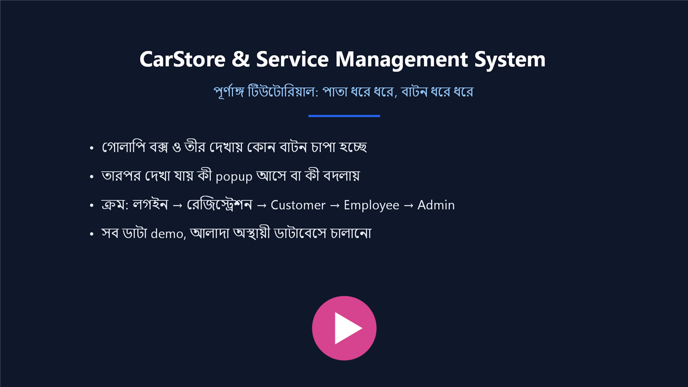](docs/demo/CarStore_Full_Tutorial.mp4)

**▶ [Watch the full tutorial](docs/demo/CarStore_Full_Tutorial.mp4)** · 16 min 26 s · 1080p · Bengali captions · no audio · about 70 MB

It covers every button and checkbox on the 16 forms, with the pop-up messages, the screens that open, the status filters, receipt previews and report data.

- The video is a sequence of still scenes. A program typed the text and clicked the buttons, so there is no real mouse movement.
- The **Browse**, **Export CSV** and **Exit** buttons are pointed at but not clicked. Windows file dialogs are left out, and the picture and CSV scenes use sample or generated data.
- Receipt pages are produced by the application's print code and placed inside the captured preview window.

<details>
<summary>Play inside this page (works only in viewers that support HTML video)</summary>

<video src="docs/demo/CarStore_Full_Tutorial.mp4" controls width="100%"></video>

</details>

| Time | Chapter |
| :---: | --- |
| 0:08 | Sign in page |
| 1:07 | Registration |
| 1:40 | Customer: dashboard buttons |
| 2:37 | Customer: showroom and buying a car |
| 4:07 | Customer: service booking |
| 4:28 | Customer: history and receipts |
| 5:26 | Customer: profile and password |
| 6:11 | Employee: dashboard buttons |
| 7:00 | Employee: purchase requests |
| 8:15 | Employee: car inventory |
| 9:57 | Employee: workshop jobs |
| 11:22 | Admin: dashboard buttons |
| 12:27 | Admin: user management |
| 14:04 | Admin: service catalog |
| 15:17 | Admin: sales report |
| 16:18 | Summary |

---

## ✨ Features

### 👤 Customer
- Register, sign in and manage own profile and password
- Browse available cars and filter by keyword, brand and budget
- View car details and send a purchase request
- Book service for a purchased car, with a chosen date and time
- See own purchase and service history
- Print receipts for confirmed sales and completed services

### 🧑‍🔧 Employee
- See pending sales and service work on a dashboard
- Add, update, remove and search cars, including photo upload
- Confirm or cancel purchase requests
- Move service jobs through their stages
- Print receipts and export the service report to CSV

### 🛡️ Admin
- See live totals: users, cars, sales revenue and pending services
- Create, edit, activate and deactivate user accounts
- Manage the car inventory and the service catalog
- Review sales records and manage service jobs
- Print receipts and export sales and service reports to CSV

---

## 🖼️ Screenshots

| Login | Customer dashboard |
| :---: | :---: |
| 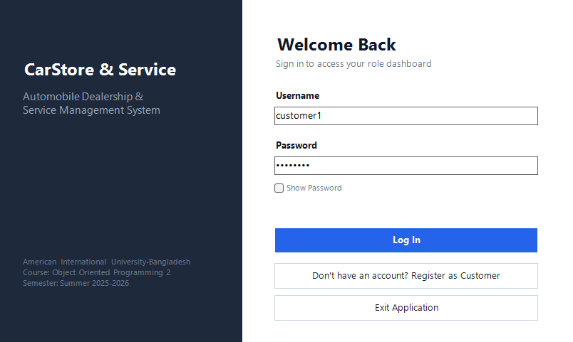 | 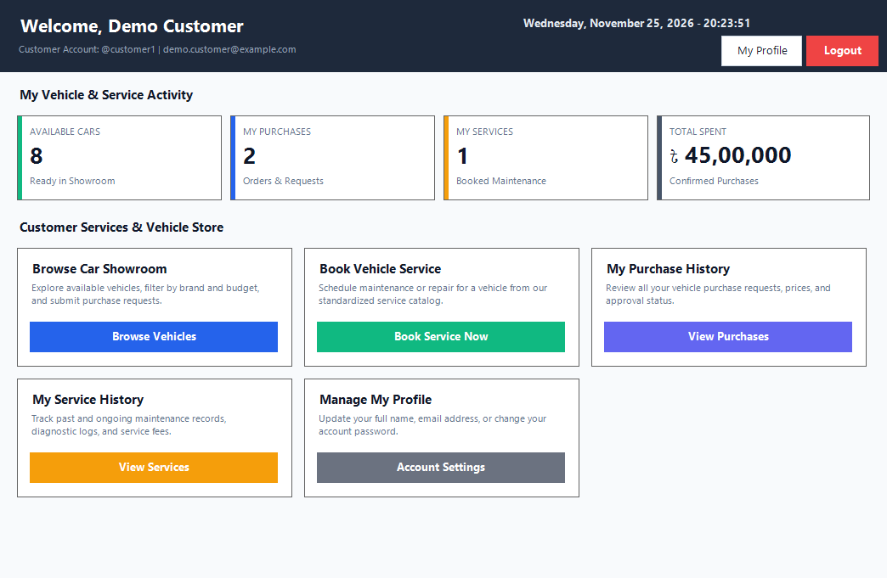 |

| Showroom | Car details |
| :---: | :---: |
| 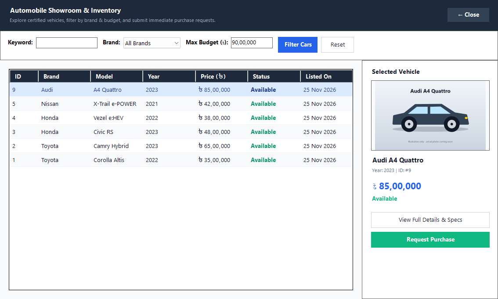 | 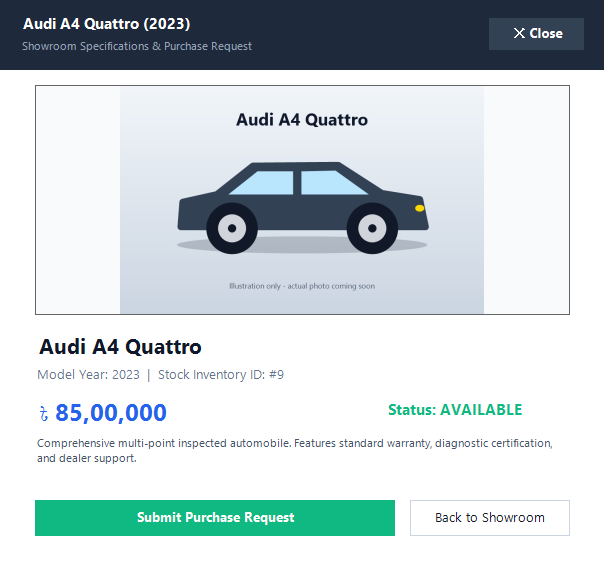 |

| Service booking | Employee dashboard |
| :---: | :---: |
| 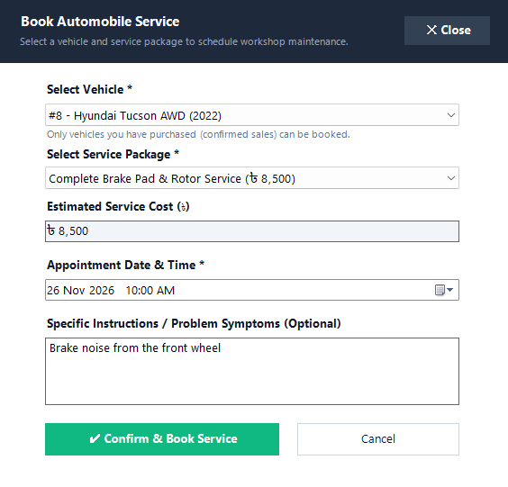 | 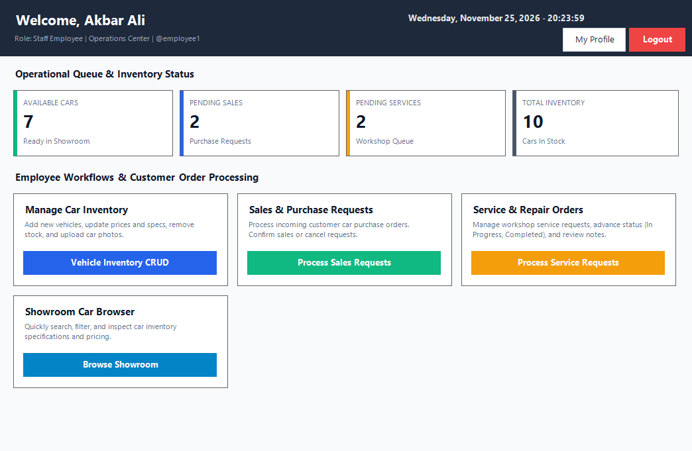 |

| Sales processing | Car inventory |
| :---: | :---: |
| 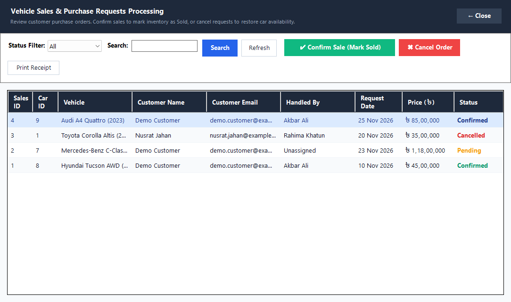 | 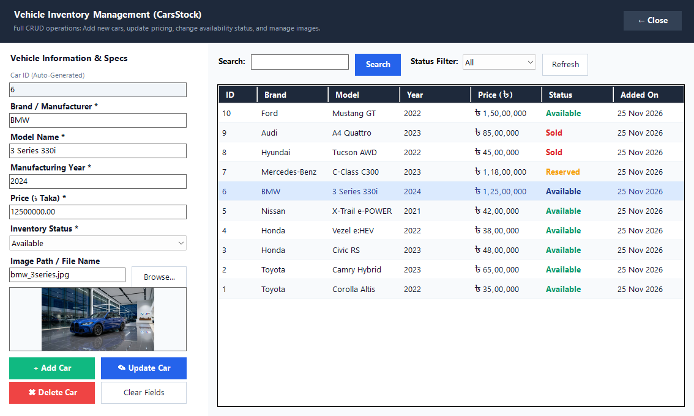 |

| Service jobs | Admin dashboard |
| :---: | :---: |
| 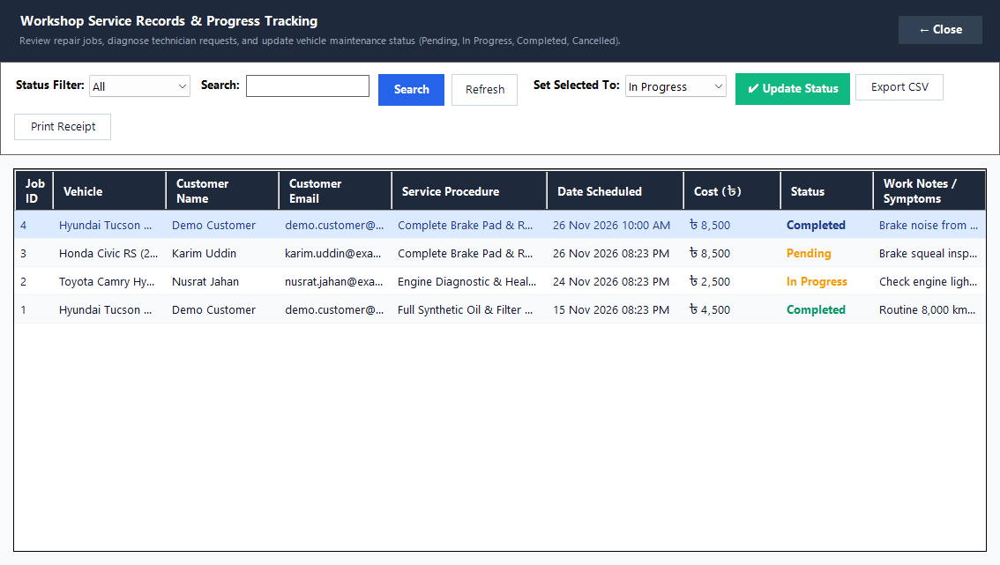 | 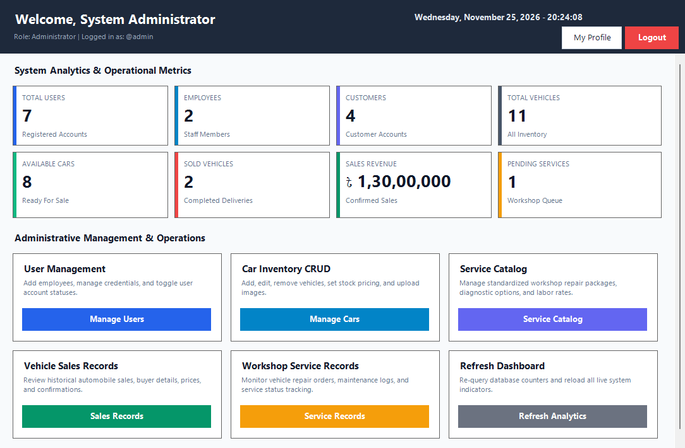 |

| User management | Sales report |
| :---: | :---: |
| 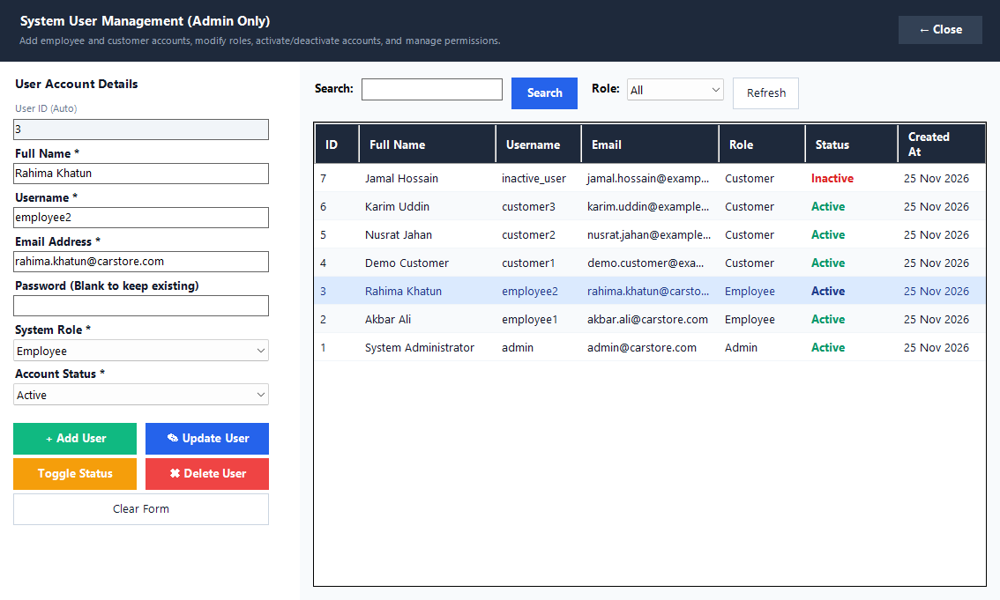 | 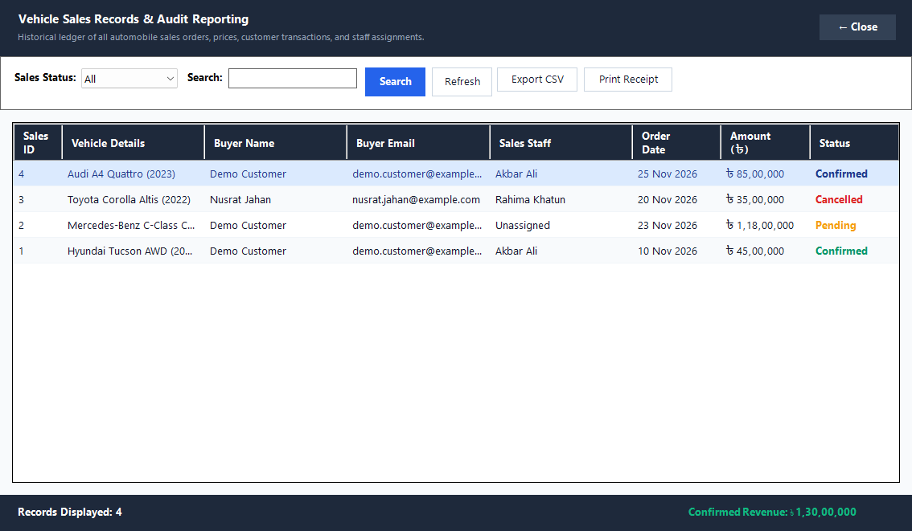 |

---

## 🧰 Technology stack

| Area | Technology | Used for |
| --- | --- | --- |
| Language | C# | All application code |
| Framework | .NET Framework 4.8 | Application runtime |
| User interface | Windows Forms (built in code) | 16 forms with a shared theme (`UITheme`) |
| Database | Microsoft SQL Server Express | Users, cars, sales and services |
| Data access | ADO.NET (`System.Data.SqlClient`) | Parameterized queries and transactions |
| Configuration | `App.config` | Connection string (Windows authentication) |
| Password security | PBKDF2 with SHA-256 | Per-user salt, 100,000 iterations |
| Printing | `System.Drawing.Printing` | Receipt print preview |
| Reporting | CSV export (UTF-8) | Reports that open in Excel |
| Build | SDK-style `.csproj`, `.sln`, .NET CLI | Build and run |
| IDE | Visual Studio 2022 (recommended) | Development and debugging |

The project references no third-party NuGet packages.

---

## 🏗️ Architecture

Forms call services, and services reach the database through one helper class. Forms contain no SQL.

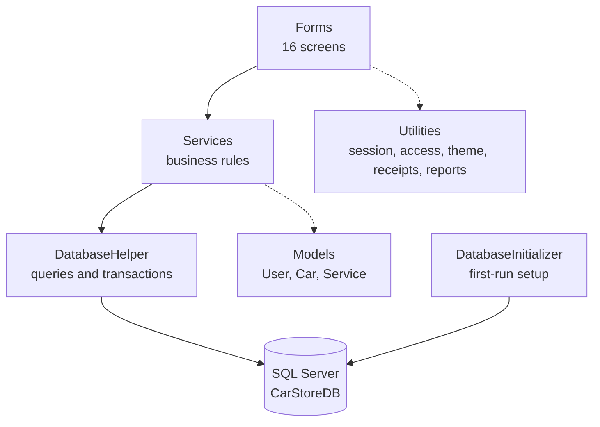
```mermaid
flowchart TD
    UI["Forms<br/>16 screens"] --> SV["Services<br/>business rules"]
    SV --> DH["DatabaseHelper<br/>queries and transactions"]
    DH --> DB[("SQL Server<br/>CarStoreDB")]
    UI -.-> UT["Utilities<br/>session, access, theme, receipts, reports"]
    SV -.-> MD["Models<br/>User, Car, Service"]
    INIT["DatabaseInitializer<br/>first-run setup"] --> DB
```

| Service | Responsibility |
| --- | --- |
| `AuthenticationService` | Login, login lock and customer registration |
| `UserService` | Accounts, profiles and passwords |
| `CarService` | Car inventory, search and filters |
| `SalesService` | Purchase requests, confirmation and cancellation |
| `ServiceManagement` | Service catalog, bookings and job status |
| `DashboardService` | Live dashboard totals |

---

## 🎭 Use case diagrams

Solid lines show what an actor can do. Dashed lines show `«include»` (always runs) and `«extend»` (optional). Mermaid has no UML use case type, so these use flowchart notation.

### Guest and Customer

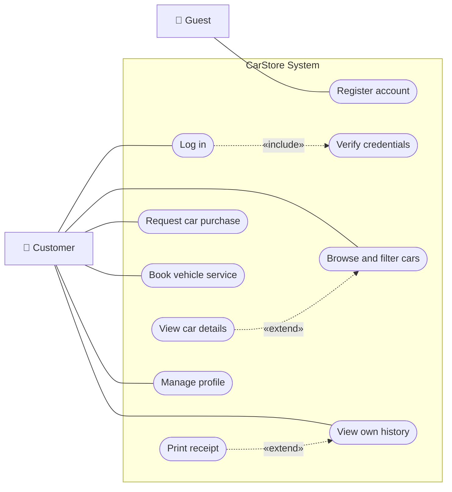
```mermaid
flowchart LR
    G["👤 Guest"]
    C["👤 Customer"]
    subgraph S["CarStore System"]
        R(["Register account"])
        L(["Log in"])
        V(["Verify credentials"])
        B(["Browse and filter cars"])
        D(["View car details"])
        P(["Request car purchase"])
        K(["Book vehicle service"])
        H(["View own history"])
        PR(["Print receipt"])
        M(["Manage profile"])
    end
    G --- R
    C --- L
    C --- B
    C --- P
    C --- K
    C --- H
    C --- M
    L -. "«include»" .-> V
    D -. "«extend»" .-> B
    PR -. "«extend»" .-> H
```

### Employee

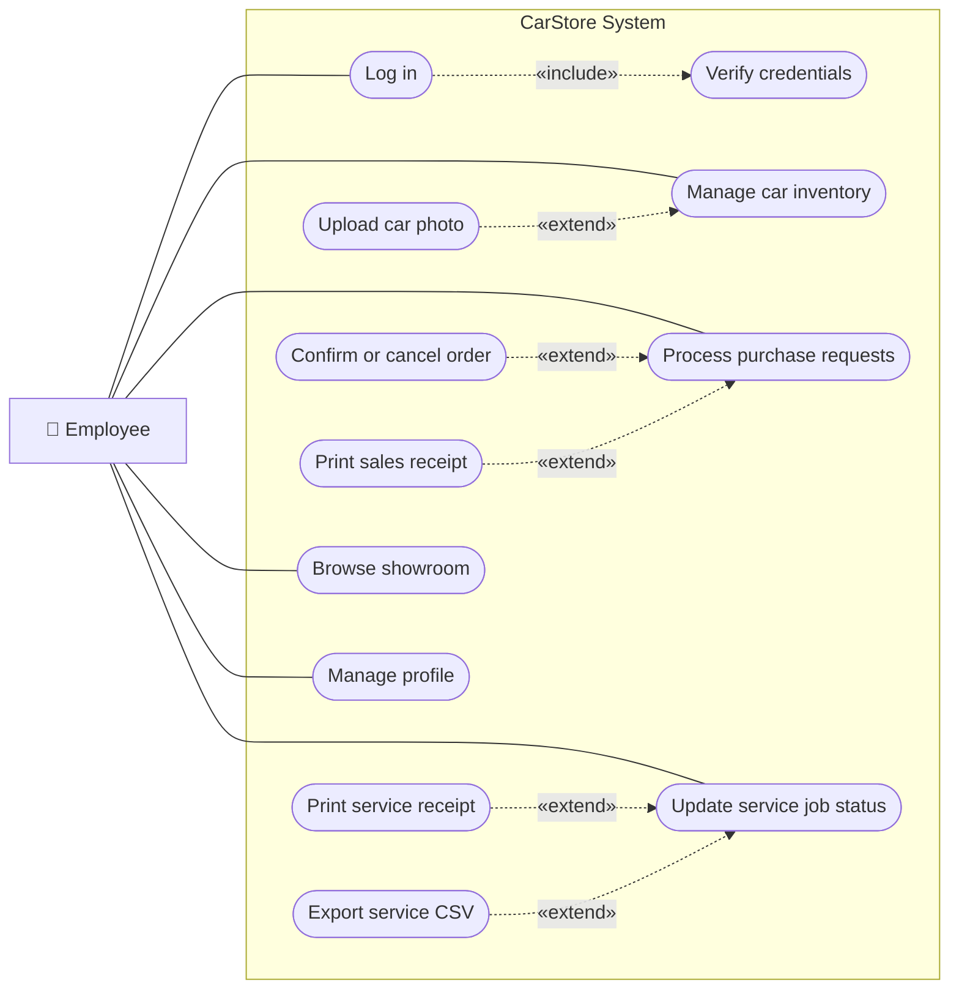
```mermaid
flowchart LR
    E["👤 Employee"]
    subgraph S["CarStore System"]
        L(["Log in"])
        V(["Verify credentials"])
        I(["Manage car inventory"])
        U(["Upload car photo"])
        Q(["Process purchase requests"])
        CC(["Confirm or cancel order"])
        SR(["Print sales receipt"])
        J(["Update service job status"])
        JR(["Print service receipt"])
        X(["Export service CSV"])
        B(["Browse showroom"])
        M(["Manage profile"])
    end
    E --- L
    E --- I
    E --- Q
    E --- J
    E --- B
    E --- M
    L -. "«include»" .-> V
    U -. "«extend»" .-> I
    CC -. "«extend»" .-> Q
    SR -. "«extend»" .-> Q
    JR -. "«extend»" .-> J
    X -. "«extend»" .-> J
```

### Admin

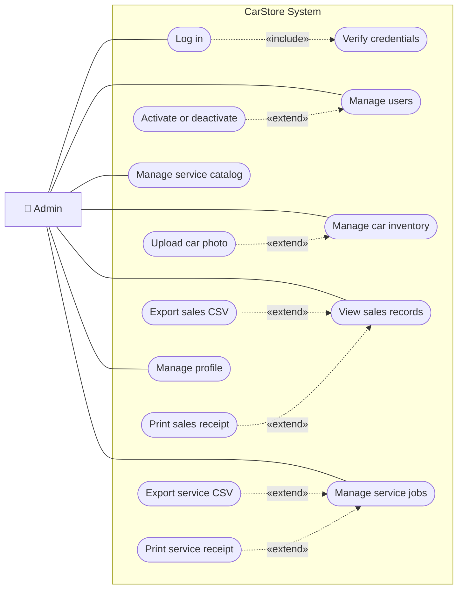
```mermaid
flowchart LR
    A["👤 Admin"]
    subgraph S["CarStore System"]
        L(["Log in"])
        V(["Verify credentials"])
        U(["Manage users"])
        T(["Activate or deactivate"])
        I(["Manage car inventory"])
        PH(["Upload car photo"])
        CAT(["Manage service catalog"])
        SA(["View sales records"])
        SX(["Export sales CSV"])
        SR(["Print sales receipt"])
        J(["Manage service jobs"])
        JX(["Export service CSV"])
        JR(["Print service receipt"])
        M(["Manage profile"])
    end
    A --- L
    A --- U
    A --- I
    A --- CAT
    A --- SA
    A --- J
    A --- M
    L -. "«include»" .-> V
    T -. "«extend»" .-> U
    PH -. "«extend»" .-> I
    SX -. "«extend»" .-> SA
    SR -. "«extend»" .-> SA
    JX -. "«extend»" .-> J
    JR -. "«extend»" .-> J
```

> The Admin dashboard has no button for confirming or cancelling purchase requests. Employees do that, and the Admin reviews the results in Sales Records.

---

## 🔄 Workflows

### Car sale

A purchase request and the car reservation are saved in one database transaction.

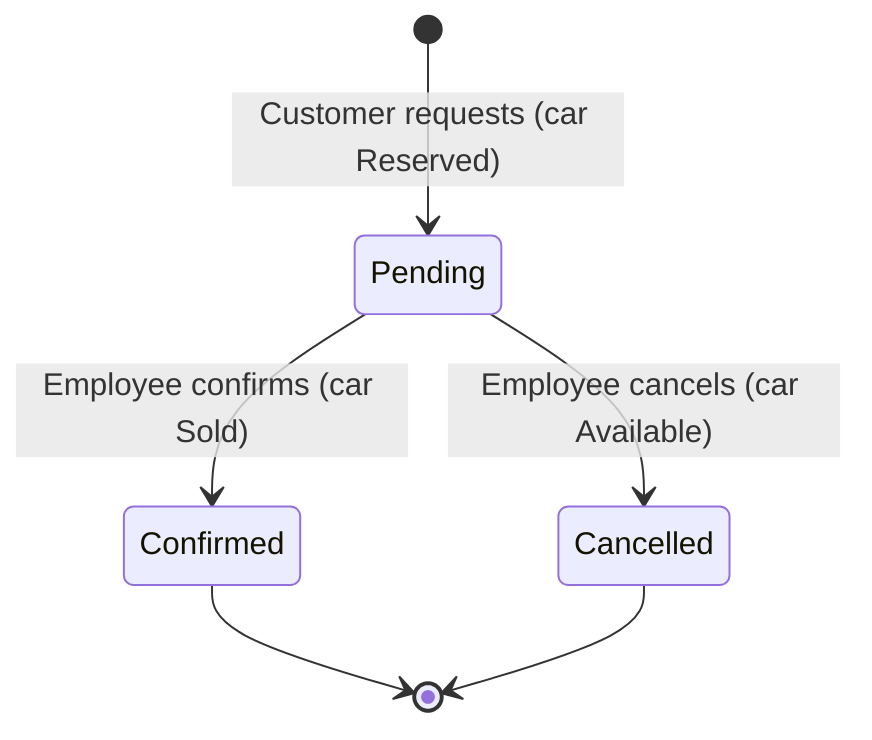
```mermaid
stateDiagram-v2
    [*] --> Pending: Customer requests (car Reserved)
    Pending --> Confirmed: Employee confirms (car Sold)
    Pending --> Cancelled: Employee cancels (car Available)
    Confirmed --> [*]
    Cancelled --> [*]
```

### Service job

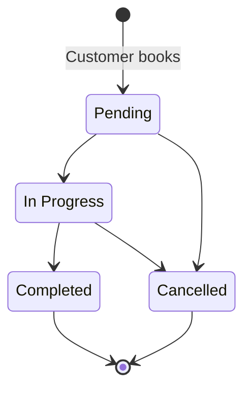
```mermaid
stateDiagram-v2
    state "In Progress" as InProgress
    [*] --> Pending: Customer books
    Pending --> InProgress
    Pending --> Cancelled
    InProgress --> Completed
    InProgress --> Cancelled
    Completed --> [*]
    Cancelled --> [*]
```

### Business rules

| Rule | Behaviour |
| --- | --- |
| Orders | Only `Pending` orders can be confirmed or cancelled |
| Price | A request is rejected if the car's price changed in the meantime |
| Booking | Only a purchased car can be booked, never in the past; the price comes from the catalog |
| Cars | A car with an active order keeps its status; a car with history is not deleted |
| Users | A user with history is deactivated instead of deleted |
| Admin safety | An Admin cannot disable their own account or change their own role |
| Catalog | A service already used in a job cannot be deleted |

---

## 🗄️ Database design

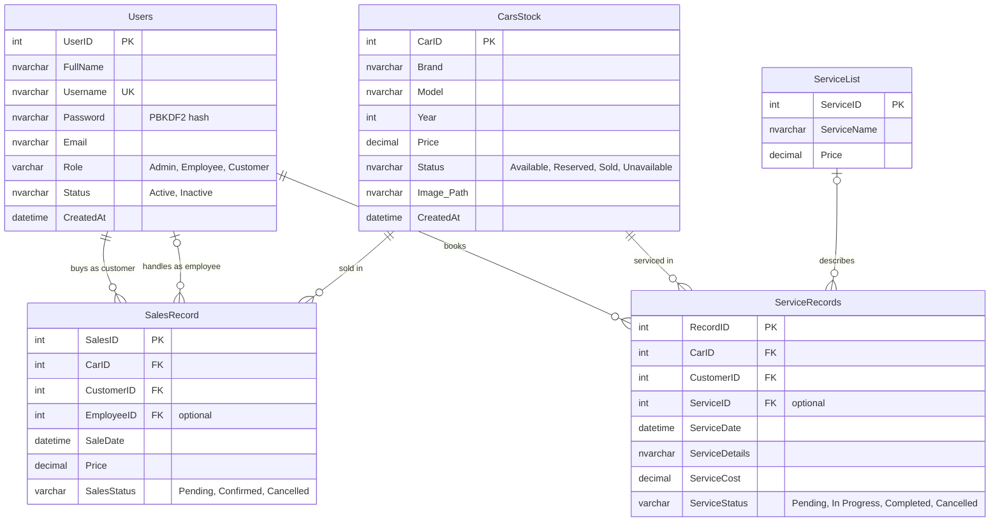
```mermaid
erDiagram
    Users ||--o{ SalesRecord : "buys as customer"
    Users |o--o{ SalesRecord : "handles as employee"
    CarsStock ||--o{ SalesRecord : "sold in"
    Users ||--o{ ServiceRecords : books
    CarsStock ||--o{ ServiceRecords : "serviced in"
    ServiceList |o--o{ ServiceRecords : "describes"

    Users {
        int UserID PK
        nvarchar FullName
        nvarchar Username UK
        nvarchar Password "PBKDF2 hash"
        nvarchar Email
        varchar Role "Admin, Employee, Customer"
        nvarchar Status "Active, Inactive"
        datetime CreatedAt
    }
    CarsStock {
        int CarID PK
        nvarchar Brand
        nvarchar Model
        int Year
        decimal Price
        nvarchar Status "Available, Reserved, Sold, Unavailable"
        nvarchar Image_Path
        datetime CreatedAt
    }
    SalesRecord {
        int SalesID PK
        int CarID FK
        int CustomerID FK
        int EmployeeID FK "optional"
        datetime SaleDate
        decimal Price
        varchar SalesStatus "Pending, Confirmed, Cancelled"
    }
    ServiceList {
        int ServiceID PK
        nvarchar ServiceName
        decimal Price
    }
    ServiceRecords {
        int RecordID PK
        int CarID FK
        int CustomerID FK
        int ServiceID FK "optional"
        datetime ServiceDate
        nvarchar ServiceDetails
        decimal ServiceCost
        varchar ServiceStatus "Pending, In Progress, Completed, Cancelled"
    }
```

All amounts are in **Bangladeshi Taka (৳)** with lakh and crore grouping, for example `৳ 1,18,00,000`.

---

## 🧩 OOP concepts

| Concept | Where it appears |
| --- | --- |
| **Encapsulation** | Private fields behind properties in `User` and `Car` |
| **Inheritance** | `AdminUser`, `EmployeeUser` and `CustomerUser` extend `User` |
| **Polymorphism** | Overridden methods such as `CanManageCars()` drive `AccessGuard`; `GetDashboardTitle()` sets window titles |
| **Abstraction** | Forms use service classes without knowing how data is stored |
| **Factory method** | `User.CreateUserByRole()` returns the right subclass |

---

## 🔐 Security

- Passwords are stored only as salted PBKDF2 hashes.
- User input reaches the database through query parameters, which protects against SQL injection.
- Restricted forms check the signed-in user's permission when they open.
- Five failed logins lock a username for 1 minute.
- CSV export neutralises text that a spreadsheet could run as a formula.
- Startup creates the database only when its tables are missing, so it does not reset existing data.

---

## 🚀 Getting started

### Prerequisites

- Windows with .NET Framework 4.8
- SQL Server Express, installed as `.\SQLEXPRESS` by default
- Visual Studio 2022 with the .NET desktop development workload, or the .NET SDK

### Run with Visual Studio

1. Open `CarStoreServiceManagement.sln`.
2. Press **F5**.

### Run from the command line

```powershell
dotnet run --project CarStoreServiceManagement.csproj
```

On first start the application creates and seeds `CarStoreDB`, then converts the seed passwords to hashes.

### Configuration

If your SQL Server instance has a different name, change `Data Source` in `App.config`:

```xml
<add name="CarStoreDB"
     connectionString="Data Source=.\SQLEXPRESS;Initial Catalog=CarStoreDB;Integrated Security=True;TrustServerCertificate=True;"
     providerName="System.Data.SqlClient" />
```

> ⚠️ **Warning:** running `Database/CarStoreDB.sql` by hand **deletes all existing data** in `CarStoreDB`. Use it only to reset the demo.

---

## 🔑 Demo accounts

These accounts are for local demonstration only. Change the passwords before any real use.

| Role | Name | Username | Password |
| --- | --- | --- | --- |
| Admin | System Administrator | `admin` | `Admin123!` |
| Employee | Akbar Ali | `employee1` | `Emp123!` |
| Employee | Rahima Khatun | `employee2` | `Emp123!` |
| Customer | Demo Customer | `customer1` | `Cust123!` |
| Customer | Nusrat Jahan | `customer2` | `Cust123!` |
| Customer | Karim Uddin | `customer3` | `Cust123!` |
| Inactive (for testing) | Jamal Hossain | `inactive_user` | `Pass123!` |

To show your own name, sign in as `customer1`, open **My Profile**, and change the name and email.

---

## 📁 Project structure

```text
CarStoreServiceManagement/
├── Data/                 DatabaseHelper, DatabaseInitializer
├── Database/             CarStoreDB.sql (schema and demo data)
├── Forms/                16 Windows Forms
├── Images/               Car pictures
├── Models/               User hierarchy, Car, Service, record models
├── Services/             Business logic
├── Utilities/            Security, session, theme, validation, receipts, reports
├── docs/
│   ├── demo/             Overview and tutorial videos with cover images
│   └── screenshots/      Application screenshots
├── App.config            Connection string
├── Program.cs            Entry point and global error handling
├── CarStoreServiceManagement.csproj
└── CarStoreServiceManagement.sln
```

---

## 🧪 Testing

- 65 scripted logic checks passed on a temporary database. The test script is not part of this repository.
- All 16 forms were opened in the running application, and the main add, update, delete, sales and service actions were tried.
- Not tested: printing on paper, the Access Denied message, running the Release build, and running from Visual Studio.

---

## 📌 Known limitations

- Customers can book service only for cars bought through this system.
- There is no online payment.
- The login lock is cleared when the application restarts.
- Eight cars use drawn illustrations instead of real photos.
- All prices are demo values, not market prices.
- Photos added at run time are stored in the build output `Images` folder, so cleaning the build removes them.

---

## 🎓 Academic context

Developed for **Object Oriented Programming 2** at **American International University-Bangladesh (AIUB)**, Summer 2025-2026.
